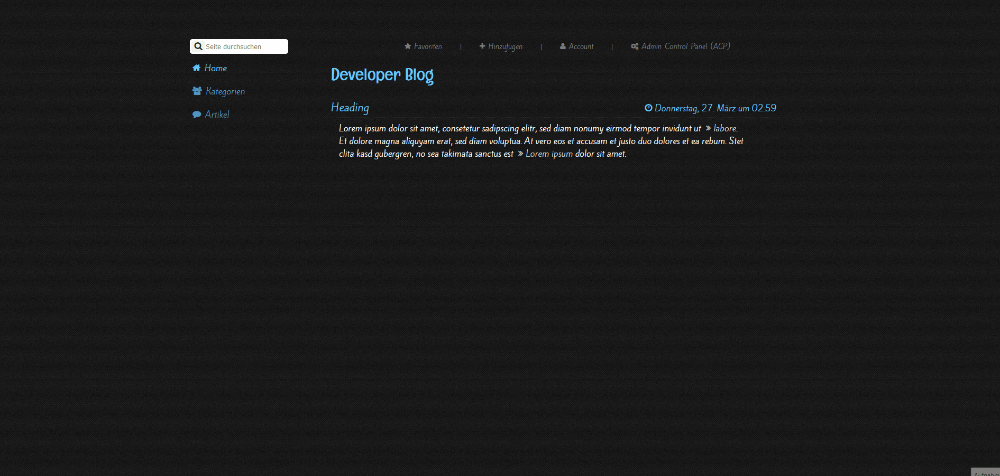

# My Old PHP Projects

> I appreciate to see that my young self already used some form of comments in my code.

## `stieb.tech`

> The intention was to deliver a fun & small text based RPG via an online "Terminal". Never came further than designing.

## `SOCIALYZE`

> Back in 2014 when i was 14, my brother and i tryed ourself at designing a social network from scratch. Unfortunately family-misfortunes happened and it came to a stop. Luckily i still have the project files. My brother designed it in photoshop, sliced it in dreamweaver and i wrote even the .css from scratch, using no framework whatsoever. Login & Register was working, aswell as profile pages, friend requests. Messages and Notifications were in an early-development state.

## `MyPHPBlog`

> Fun little side project in early beginnings, trying my self on own .css files.