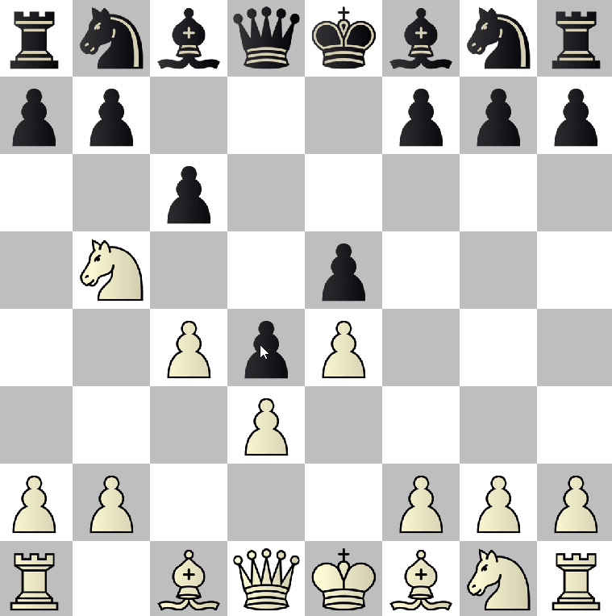

# PyChess

ChessEngine.py has all game logic & ChessMain.py has all main functions. To start, you are required to have the library "pygame" & then in cmd or use run.bat
> py chessmain.py

- [x] En Passant
- [x] Castling
- [x] Checkmate
- [x] Stalemate
- [x] Valid and Possible Moves
- [x] Pawn Promotion
- [ ] UI for possible squares for grabbed piece
- [ ] UI for moves & pgn support

